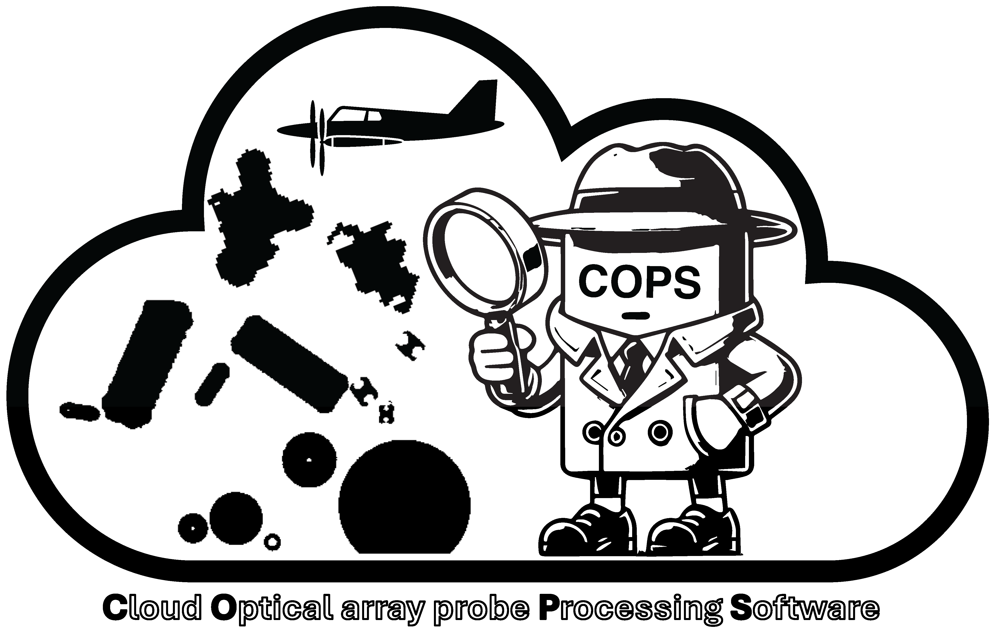

# COPS Cookbook



[](https://github.com/huangynj/cookbook_test/actions/workflows/nightly-build.yaml)
[](https://binder.projectpythia.org/v2/gh/huangynj/cookbook_test/main?labpath=notebooks)

This cookbook provides practical, reproducible examples for using the **Cloud Optical-array probe Processing Software (COPS)**.
The focus is on **hands-on notebooks** that demonstrate how to process and analyze optical array probe data.

---

## Motivation

The goal of this cookbook is to provide a comprehensive guide for researchers and developers working with COPS.
By the end of the cookbook, readers will be able to:

- Understand the structure of a reproducible scientific workflow
- Run and modify Jupyter notebooks interactively
- Adapt the provided examples to their own research or applications

---

## Authors

[Yongjie Huang](https://huangynj.github.io)

### Contributors

<a href="https://github.com/huangynj/cookbook_test/graphs/contributors">
  
</a>

---

## Current Structure

This cookbook is organized into the following sections:

### 1. Preamble

This section explains how to cite the cookbook and the COPS software.

### 2. Introduction

This section verifies the COPS installation and establishes the environment expected by future workflow notebooks.

---

## Running the Notebooks

Run the notebooks locally with a COPS source checkout:

1. Clone the repository:
   ```bash
   git clone https://github.com/huangynj/cookbook_test.git
   cd cookbook_test
   ```

2. Create the environment:
   ```bash
   conda env create -f environment.yml
   conda activate cookbook-dev
   ```

   If the environment already exists, update it instead:
   ```bash
   conda env update -f environment.yml --prune
   conda activate cookbook-dev
   ```

3. Install COPS from source:
   ```bash
   python -m pip install -e ../COPS
   ```

   If the COPS checkout is somewhere else, replace `../COPS` with that path.

4. Start the server:
   ```bash
   myst start
   ```

This will start a local web server and open the cookbook in your browser.

> **Note:** Do not use `pip install cops` for this cookbook. The `cops` package name on PyPI currently points to unrelated cloud-infrastructure software. Install the local COPS source checkout instead.
